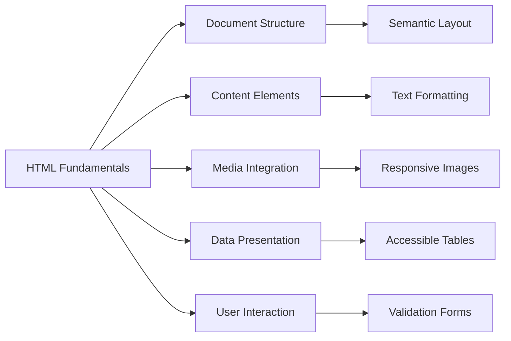
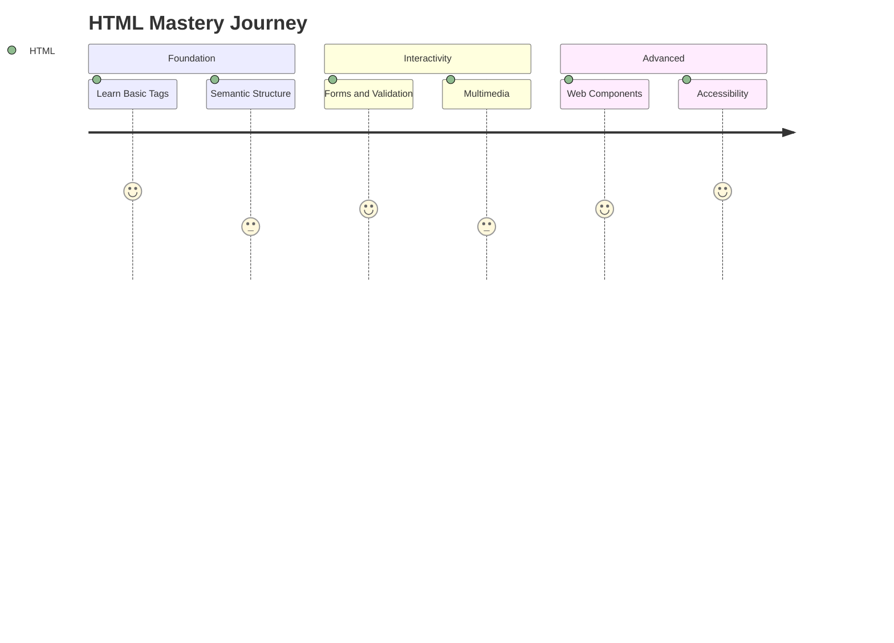

# 🌐 Ultimate HTML Reference Guide  
*Master HyperText Markup Language with Interactive Examples and Visual References*



## 🏗️ HTML Document Anatomy

### Essential Structure
```html
<!DOCTYPE html>
<html lang="en">
<head>
    <meta charset="UTF-8">
    <meta name="viewport" content="width=device-width, initial-scale=1.0">
    <title>Page Title</title>
    <link rel="icon" href="favicon.ico" type="image/x-icon">
</head>
<body>
    <header>
        <h1>Welcome to HTML</h1>
    </header>
    <main>
        <!-- Content goes here -->
    </main>
    <footer>
        <p>&copy; 2023 HTML Guide</p>
    </footer>
</body>
</html>
```

**Browser Result**:  
- Tab displays page title and favicon
- Responsive mobile-ready layout
- Semantic header/main/footer sections
- Proper character encoding for multilingual support

## 📝 Content Elements

### Text Formatting
```html
<h1>Main Heading</h1>
<h2>Section Title</h2>
<p>This is a <strong>key point</strong> with <em>emphasis</em>.</p>
<blockquote cite="https://example.com">
    Important quotation
</blockquote>
<pre><code>console.log("Code sample");</code></pre>
```

**Visual Output**:  
```
MAIN HEADING (largest text)
Section Title (medium heading)

This is a KEY POINT with emphasis.

| Important quotation   |
| (styled as indented)  |

console.log("Code sample"); 
(monospace font, preserves whitespace)
```

## 🔗 Navigation & Media

### Hyperlinks with Targets
```html
<nav>
    <a href="#section1" aria-current="page">Current</a>
    <a href="https://external.com" target="_blank" rel="noopener">External ↗</a>
    <a href="mailto:contact@example.com">Email Us</a>
</nav>
```

**User Experience**:  
- Navigation bar with three links:
  1. "Current" (highlighted as active page)
  2. "External ↗" (opens new secure tab)
  3. "Email Us" (launches email client)

### Responsive Images
```html
<picture>
    <source media="(min-width: 800px)" srcset="large.jpg">
    <source media="(min-width: 400px)" srcset="medium.jpg">
    
</picture>
```

**Display Behavior**:  
- Loads different image files based on screen size
- Small image on mobile, medium on tablet, large on desktop
- Lazy loading for performance optimization
- Alt text shown during loading/errors

## 📊 Data Presentation

### Accessible Table
```html
<table>
  <caption>Monthly Budget</caption>
  <thead>
    <tr>
      <th scope="col">Category</th>
      <th scope="col">Amount</th>
    </tr>
  </thead>
  <tbody>
    <tr>
      <td>Housing</td>
      <td>$1,200</td>
    </tr>
    <tr>
      <td>Food</td>
      <td>$400</td>
    </tr>
  </tbody>
  <tfoot>
    <tr>
      <td>Total</td>
      <td>$1,600</td>
    </tr>
  </tfoot>
</table>
```

**Rendered Table**:  
```
+----------+--------+
| Category | Amount |
+----------+--------+
| Housing  | $1,200 |
| Food     | $400   |
+----------+--------+
| Total    | $1,600 |
+----------+--------+
```
- Clear caption and scoped headers
- Semantic head/body/foot sections
- Responsive design (horizontal scroll on mobile)

### Definition Lists
```html
<dl>
  <dt>HTML</dt>
  <dd>HyperText Markup Language</dd>
  
  <dt>CSS</dt>
  <dd>Cascading Style Sheets</dd>
</dl>
```

**Visual Format**:  
```
HTML
    HyperText Markup Language
CSS
    Cascading Style Sheets
```
(Terms bolded, descriptions indented)

## 📨 User Interaction

### Modern Form with Validation
```html
<form id="signup">
  <fieldset>
    <legend>Create Account</legend>
    
    <label for="email">Email*</label>
    <input type="email" id="email" required 
           placeholder="user@example.com">
    
    <label for="pass">Password*</label>
    <input type="password" id="pass" required
           minlength="8" pattern="\S+[A-Z]">
    
    <label for="avatar">Profile Photo</label>
    <input type="file" id="avatar" accept="image/*">
    
    <button type="submit">Register</button>
  </fieldset>
</form>
```

**Interactive Features**:  
- Required email field with format validation
- Password strength requirements (8+ chars, capital letter)
- File picker for images only
- Fieldset grouping with legend title
- Accessible labels and error messages

### Dynamic Controls
```html
<details>
  <summary>Show Advanced Options</summary>
  <label><input type="checkbox"> Enable feature</label>
  <label><input type="range" min="0" max="100"> Intensity</label>
</details>

<dialog id="confirmation">
  <p>Account created successfully!</p>
  <button onclick="document.getElementById('confirmation').close()">
    OK
  </button>
</dialog>
```

**User Experience**:  
- Expandable "Advanced Options" section
- Slider control for value selection
- Modal dialog popup for confirmation
- Built-in animations and focus management

## 🎥 Multimedia Integration

### Video Player with Tracks
```html
<video controls width="100%" poster="preview.jpg">
  <source src="tutorial.mp4" type="video/mp4">
  <source src="tutorial.webm" type="video/webm">
  <track kind="captions" src="captions.vtt" srclang="en" 
         label="English" default>
  Your browser doesn't support HTML5 video.
</video>
```

**Player Features**:  
- Responsive width (100% container)
- Custom preview thumbnail
- Multiple format support (MP4/WebM)
- Closed captions toggle
- Adaptive streaming ready

### Audio Player
```html
<audio controls>
  <source src="audio.mp3" type="audio/mpeg">
  <source src="audio.ogg" type="audio/ogg">
  Your browser doesn't support the audio element.
</audio>
```

**Audio Controls**:  
- Play/pause button
- Progress bar
- Volume control
- Playback speed options
- Keyboard accessible

## 🌐 Semantic Web Layout

### Modern Page Structure
```html
<body>
  <header>
    <nav aria-label="Main">...</nav>
  </header>
  
  <main>
    <article>
      <h1>Article Title</h1>
      <section aria-labelledby="s1">
        <h2 id="s1">Introduction</h2>
        ...
      </section>
    </article>
    
    <aside aria-label="Related content">
      <h2>Recommended</h2>
      ...
    </aside>
  </main>
  
  <footer role="contentinfo">
    <address>Contact: email@example.com</address>
  </footer>
</body>
```

**SEO & Accessibility Benefits**:  
- Clear document outline for screen readers
- ARIA landmarks for navigation
- Semantic content separation
- Improved search engine understanding
- Responsive-ready structure

## 📚 Progressive Learning Path



1. **Beginner**: Tags, Attributes, Basic Structure
2. **Intermediate**: Forms, Tables, Media, Semantics
3. **Advanced**: Web Components, Shadow DOM, ARIA
4. **Expert**: Microdata, Performance Optimization

## 🛠️ Developer Toolkit

### Essential Meta Tags
```html
<!-- Character encoding -->
<meta charset="UTF-8">

<!-- Viewport for responsive design -->
<meta name="viewport" content="width=device-width, initial-scale=1.0">

<!-- Page description for SEO -->
<meta name="description" content="Comprehensive HTML guide">

<!-- Social media sharing -->
<meta property="og:title" content="HTML Mastery">
<meta property="og:image" content="social-preview.jpg">

<!-- Browser compatibility -->
<meta http-equiv="X-UA-Compatible" content="IE=edge">
```

### Validation Tools
- [W3C Validator](https://validator.w3.org/)
- [HTMLHint](https://htmlhint.com/)
- [Lighthouse](https://developer.chrome.com/docs/lighthouse/overview/)
- [axe DevTools](https://www.deque.com/axe/devtools/)

## 🤝 Contribution Guide

**Improve this documentation**:  
1. Fork repository
2. Create feature branch (`git checkout -b feat/new-section`)
3. Add examples with visual descriptions
4. Update table of contents
5. Submit pull request

**Contribution Guidelines**:  
- Use modern HTML5 standards
- Include accessibility features
- Provide browser compatibility notes
- Keep examples self-contained
- Add visual result descriptions

---

**Last Updated**: June 2023  
[View Changelog](#) | [Report Issue](#) | [Edit This Page](#)  
*Created with ❤️ for the web community*